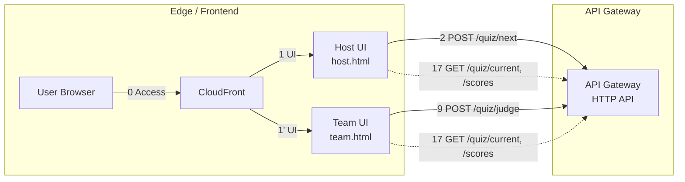
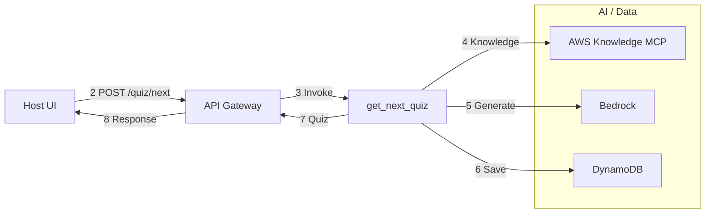
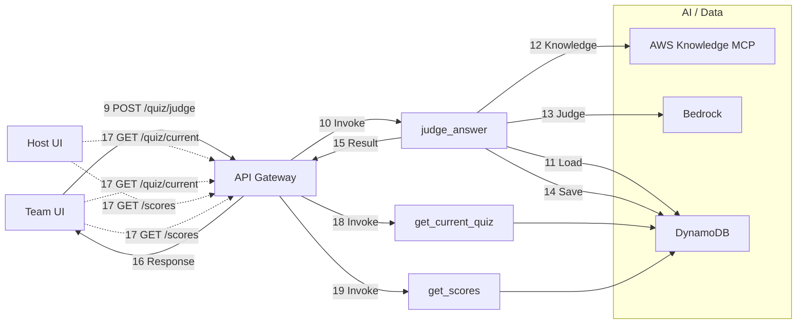
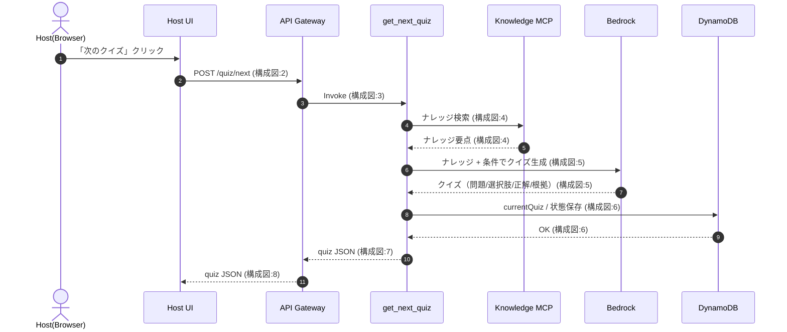
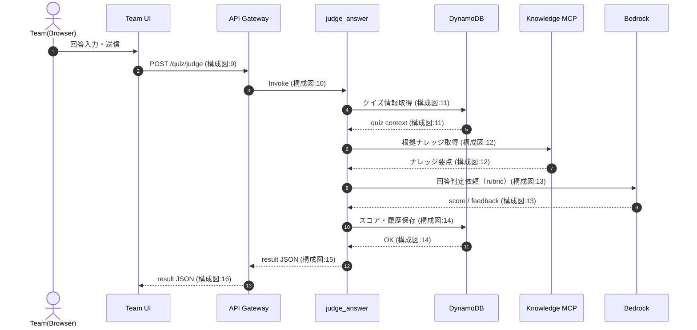
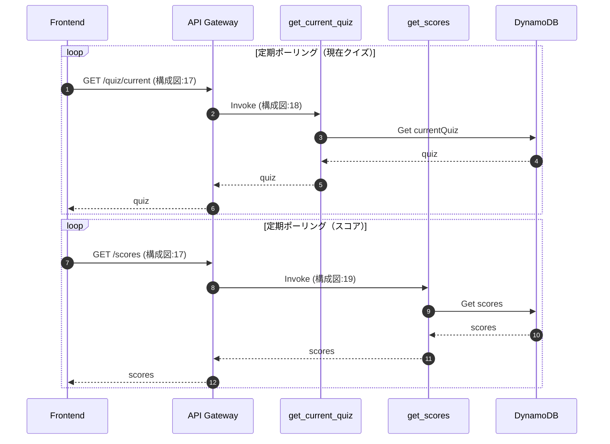

# aws_knowledge_quiz

## 概要

AWS SAM + Python + バニラJavaScriptで構築されたSPAのAWSクイズ出題アプリケーションです。

**主な機能**:
- AWS Knowledge MCP Serverを情報源としたクイズ自動生成
- Amazon Bedrock（Claude Sonnet）による採点とフィードバック
- rubric（採点基準）ベースの詳細な評価システム
- リアルタイムスコアボード（複数チーム対応）
- 重複回避機能（カーソルベースのクエリローテーション）

**技術スタック**:
- バックエンド: AWS SAM, Python 3.14, Lambda, DynamoDB, Bedrock, API Gateway
- フロントエンド: S3 + CloudFront, バニラJavaScript（SPA）
- AI/ML: Amazon Bedrock（Claude Sonnet 4.5）, AWS Knowledge MCP Server
- セキュリティ: Lambda Authorizer, CloudFrontカスタムヘッダー認証

## Lambda関数の処理概要

### GetNextQuizFunction（クイズ生成）
**役割**: 新しいクイズを生成して出題

**処理フロー**:
1. **MCP検索クエリの決定的生成**
   - カテゴリ（security、networking、storage、serverless、well-architected）ごとに定義された部品（services、topics、angles）から組み合わせを生成
   - カーソルベースでインデックスを管理し、同じクエリの繰り返しを回避
   - クエリ空間サイズ = services数 × topics数 × angles数

2. **AWS Knowledge MCP Serverからの情報取得**
   - 生成されたクエリでMCP検索を実行
   - 最大3件のスニペットを取得（SOURCE_SNIPPETS_MAX: 3）
   - 合計1500文字以内に制限（SOURCE_CONTEXT_MAX_CHARS: 1500）

3. **Bedrock Prompt Managementでクイズ生成**
   - プロンプト変数: category、level、avoid_duplicate_hint（最近15問）、question_style、style_guidance、source_context
   - MaxTokens: 2400、Temperature: 0.15
   - JSON形式で出力（コードフェンス除去処理あり）

4. **重複チェックと保存**
   - タイトル、本文、必須要点からハッシュ値を生成
   - DynamoDBに条件付き書き込み（重複時は失敗）
   - 成功時はカーソルを進める（次回は異なるクエリを使用）

5. **リトライとタイムアウト**
   - MAX_MCP_REFRESH: 2（異なるMCPクエリで最大2回再試行）
   - 残り時間35秒未満で生成ループを停止
   - 重複時は503エラーを返し、クライアント側で再試行を促す

**パフォーマンス設定**:
- Lambda実行時間: 60秒、メモリ: 2048MB
- Bedrock接続タイムアウト: 5秒、読み取りタイムアウト: 25秒

### JudgeAnswerFunction（回答採点）
**役割**: ユーザーの回答を採点してフィードバックを提供

**処理フロー**:
1. **問題情報の取得**
   - questionIdでDynamoDBから問題とrubric（採点基準）を取得

2. **Bedrockでの採点**
   - SYSTEM_PROMPT: 採点者の役割とルールを定義
   - USER_PROMPT: 問題本文、rubric、ユーザー回答を含む
   - 出力: result、score、mustPointsMet、missingMustPoints、feedback、nextHint

3. **採点結果の検証**
   - mustPointsMetとmissingMustPointsの整合性チェック
   - スコアの範囲チェック（0.0〜1.0）
   - scoringPolicyとの整合性確認

4. **スコア反映**
   - 初回回答: ScoresTableにスコアを加算
   - 再評価: AnswerHistoryTableのみ更新（スコアは変更しない）
   - 回答履歴に詳細情報を記録（result、score、feedback、試行回数）

**rubric（採点基準）の構造**:
- **mustHavePoints**: 必須要点（通常4個）- 正解判定に必須
- **niceToHavePoints**: 加点要素（0〜1個）- より深い理解を示す内容
- **commonWrongClaims**: よくある誤解（0〜1個）- 含まれると減点
- **scoringPolicy**: 採点ポリシー（correct_threshold: 1.0、close_threshold: 0.8）

### GetCurrentQuizFunction（現在クイズ取得）
**役割**: 現在出題中のクイズを取得

**処理フロー**:
- DynamoDB GSI_Recentから最新1件を取得
- 問題情報（タイトル、本文、カテゴリ、レベル）を返却

**用途**: Host/Team両UIから15秒ごとにポーリング

### GetScoresFunction（スコアボード取得）
**役割**: 全チームのスコアボードを取得

**処理フロー**:
- ScoresTableをScanして全チームのスコアを取得
- スコア降順、更新日時降順でソート
- チーム名、スコア、更新日時を返却

### StartQuizGenerationFunction（クイズ生成開始）
**役割**: クイズ生成を非同期で開始

**処理フロー**:
- GetNextQuizFunctionを非同期で呼び出し
- 即座にレスポンスを返却（生成完了を待たない）

### SubmitScoreFunction（スコア送信）
**役割**: 採点結果をスコアボードに反映

**処理フロー**:
- AnswerHistoryTableで回答履歴を確認（初回か再評価か判定）
- 初回回答の場合のみScoresTableにスコアを加算
- 再評価の場合は履歴のみ更新（スコアは変更しない）

### GetQuizByIdFunction（過去問取得）
**役割**: questionIdを指定して過去のクイズを取得

**処理フロー**:
- questionIdをキーにDynamoDBから問題を取得
- 復習機能や過去問参照に使用

## デプロイ方法

### 前準備

- リポジトリのクローン

```bash
git clone https://github.com/hatanoyoshihiko/aws_knowledge_quiz.git
```

- 変数定義

```bash
export AWS_REGION=ap-northeast-1
export FRONTEND_STACK_NAME=aws-knowledge-quiz-frontend
export BACKEND_STACK_NAME=aws-knowledge-quiz-backend
export AWS_PROFILE=YOUR_PROFILE
export API_HEADER_VALUE=YOUR_SECRET_HEADER_VALUE
```

### バックエンドのデプロイ

- CloudFrontのURLを変数として格納する

```bash
CLOUDFRONT_URL="$(aws cloudformation describe-stacks \
  --region "$AWS_REGION" \
  --stack-name "$FRONTEND_STACK_NAME" \
  --query "Stacks[0].Outputs[?OutputKey=='CloudFrontUrl'].OutputValue" \
  --output text)"

echo "CloudFrontUrl=$CLOUDFRONT_URL"
```

- デプロイ
  - StageName: API Gatewayのステージ名（例: dev, prod）
  - FrontendOrigin: CloudFrontのURL（CORS設定用）
  - CloudFrontToApiHeaderValue: CloudFrontからAPI Gatewayへの認証用ヘッダー値（任意の秘密文字列）
  - HostKey: 出題者側UIで入力するキー（任意の値、例: 123456789）
  - CloudFrontDNSName: CloudFrontのドメイン名
  - GeoRestrictionLocations: 地理的制限（例: JP、複数の場合はカンマ区切り）
  - BedrockGuardrailIdentifier: Bedrock Guardrail ID（オプション）
  - BedrockGuardrailVersion: Bedrock Guardrail Version（オプション、デフォルト: DRAFT）

```bash
cd backend
sam build
sam deploy \
  --stack-name "$BACKEND_STACK_NAME" \
  --region "$AWS_REGION" \
  --resolve-s3 \
  --capabilities CAPABILITY_IAM \
  --parameter-overrides \
    StageName=dev \
    FrontendOrigin="https://d1234567890abc.cloudfront.net" \
    CloudFrontToApiHeaderValue="$API_HEADER_VALUE" \
    HostKey=YOUR_HOST_KEY \
    CloudFrontDNSName="d1234567890abc.cloudfront.net" \
    GeoRestrictionLocations=JP \
    BedrockGuardrailIdentifier=YOUR_GUARDRAIL_ID \
    BedrockGuardrailVersion=1
```

- API EndpointのURLを変数として格納する

```bash
API_ENDPOINT="$(aws cloudformation describe-stacks \
  --region "$AWS_REGION" \
  --stack-name "$BACKEND_STACK_NAME" \
  --query "Stacks[0].Outputs[?OutputKey=='ApiGatewayDomainName'].OutputValue" \
  --output text)"

API_ORIGIN_PATH="$(aws cloudformation describe-stacks \
  --region "$AWS_REGION" \
  --stack-name "$BACKEND_STACK_NAME" \
  --query "Stacks[0].Outputs[?OutputKey=='ApiGatewayOriginPath'].OutputValue" \
  --output text)"

echo "ApiGatewayDomainName=$API_ENDPOINT"
echo "ApiGatewayOriginPath=$API_ORIGIN_PATH"
```

### フロントエンドのデプロイ

- この時点ではまだコンテンツファイルはアップロードしません。
  - CloudFrontToApiHeaderValue: バックエンドと同じ値を設定
  - ApiGatewayDomainName: API Gatewayのドメイン名（例: abc123.execute-api.ap-northeast-1.amazonaws.com）
  - ApiGatewayOriginPath: API Gatewayのステージパス（例: /dev）

```bash
cd frontend
sam build
sam deploy \
  --stack-name "$FRONTEND_STACK_NAME" \
  --region "$AWS_REGION" \
  --resolve-s3 \
  --capabilities CAPABILITY_IAM \
  --parameter-overrides \
    CloudFrontToApiHeaderValue="$API_HEADER_VALUE" \
    ApiGatewayDomainName="abc123.execute-api.ap-northeast-1.amazonaws.com" \
    ApiGatewayOriginPath=/dev
```

- フロントエンド用S3バケット名を変数として格納する

```bash
BUCKET_NAME="$(aws cloudformation describe-stacks \
  --region "$AWS_REGION" \
  --stack-name "$FRONTEND_STACK_NAME" \
  --query "Stacks[0].Outputs[?OutputKey=='FrontendBucketName'].OutputValue" \
  --output text)"

echo "BucketName=$BUCKET_NAME"
```

- index.htmlとconfig.jsonのアップロード

```bash
cd ../frontend
aws s3 sync public "s3://$BUCKET_NAME/" --delete
```

### 動作確認

`echo "https://$CLOUDFRONT_URL"`

## UI

### 出題側（Host UI）

**機能**:
- Host Key認証（バックエンドのデプロイ時に指定したHostKeyを入力）
- カテゴリとレベルの選択
- 次のクイズ生成（30秒程度で生成完了）
- スコアボード表示（10位までを表示、11位以降は折りたたみ）
- 現在出題中のクイズ表示（15秒ごとに自動更新）

**操作フロー**:
1. Host Keyを入力してログイン
2. カテゴリ（security、networking、storage、serverless、well-architected）を選択
3. レベル（100=基礎、200=設計、300=実装、400=専門家）を選択
4. 「次のクイズ」ボタンを押下
5. 生成されたクイズが全チームに共有される

### 回答側（Team UI）

**機能**:
- 出題側と同じクイズが自動表示（15秒ごとに自動更新、「更新」ボタンで即時反映）
- チーム名入力
- 回答入力と採点
- 採点結果の詳細表示（スコア、フィードバック、要点の充足状況）
- スコアボード表示

**操作フロー**:
1. チーム名を入力
2. 回答欄に回答を入力
3. 「採点する」ボタンを押下
4. 結果にスコアとフィードバックが表示される
5. 「詳細表示」ボタンで必須要点の充足状況を確認可能

**採点結果の表示**:
- **correct**: 必須要点を100%充足（通常4個すべて）
- **close**: 必須要点を80%以上充足（通常3個以上）
- **incorrect**: 必須要点の充足が不十分
- フィードバック: 最大400字のトンチを利かせたユーモアに富んだ文章
- 要点詳細: mustPointsMet（充足した要点）、missingMustPoints（不足している要点）

## 仕様

### システム構成図

> ※ 本図は処理全体の俯瞰を目的としており、
> クイズ状態・スコアの同期（GET /quiz/current, /scores）は
> ポーリングとして簡略表現しています。
> 詳細な処理順は以下のシーケンス図を参照してください。

### 1) エッジ＋API入口



### 2) 出題フロー（NextQuiz）



### 3) 採点＋同期（Judge / Sync）



### シーケンス図

- 「次のクイズ」ボタンを押したとき



- 「採点する」ボタンを押したとき



- クイズの表示同期（全クライアント）



## 主なロジック

クイズや採点アルゴリズムは [logic.md](./docs/logic.md) を参照下さい。

## クイズの出題内容を調整する場合

### クイズ生成のカスタマイズ

ファイル: `backend/src/get_next_quiz/app.py`

**QUERY_COMPONENTS（MCP検索クエリ生成用の部品）**:
- カテゴリごとに定義（security、networking、storage、serverless、well-architected）
- 各カテゴリに以下の部品を定義:
  - **services**: AWSサービス名のリスト
  - **topics**: トピック（機能、概念）のリスト
  - **angles**: 観点（設計、実装、トラブルシューティング等）のリスト
- 決定的な組み合わせでクエリを生成し、重複を回避

**QUESTION_STYLES（出題スタイル）**:
- 使い分け: 複数の選択肢から最適なものを選ぶ問題
- トレードオフ: メリット・デメリットを考慮する問題
- 誤り探し: 誤った記述を見つける問題
- 運用・障害対応: 実際の運用シナリオに基づく問題
- 監査・コンプラ観点: セキュリティやコンプライアンスに関する問題
- コスト最適化: コスト削減や最適化に関する問題

**カスタマイズ方法**:
1. QUERY_COMPONENTSに新しいサービスやトピックを追加
2. QUESTION_STYLESに新しい出題スタイルを追加
3. Bedrock Prompt Managementでプロンプトテンプレートを調整

### 採点基準のカスタマイズ

ファイル: `backend/src/judge_answer/app.py`

**rubric（採点基準）の調整**:
- **mustHavePoints**: 必須要点の数を変更（デフォルト: 4個）
- **scoringPolicy**: 閾値を調整
  - correct_threshold: 正解判定の閾値（デフォルト: 1.0）
  - close_threshold: 惜しい判定の閾値（デフォルト: 0.8）
  - correct_if_must_points_met_at_least: 正解に必要な必須要点数（デフォルト: 4）
  - close_if_must_points_met_at_least: 惜しいに必要な必須要点数（デフォルト: 3）

**フィードバックの調整**:
- 最大長: 400字（FEEDBACK_MAX_LENGTHで変更可能）
- トーン: トンチを利かせたユーモアに富んだ文章（プロンプトで調整）

## Bedrockのコンフィグ

### クイズ生成（GetNextQuizFunction）
- **モデル**: jp.anthropic.claude-sonnet-4-5-20250929-v1:0
- **MaxTokens**: 2400（JSON完全出力を保証）
- **Temperature**: 0.15（多様性と品質のバランス）
- **タイムアウト**: 接続5秒、読み取り25秒、リトライ1回
- **プロンプト管理**: Bedrock Prompt Management使用
- **プロンプト変数**:
  - category: カテゴリ（security、networking等）
  - level: 難易度（100=基礎、200=設計、300=実装、400=専門家）
  - avoid_duplicate_hint: 最近15問のヒント（タイトル、タグ、論点）
  - question_style: 出題スタイル
  - style_guidance: スタイル別の出題方針
  - source_context: MCP検索結果（最大1500文字）

### 回答採点（JudgeAnswerFunction）
- **モデル**: jp.anthropic.claude-sonnet-4-5-20250929-v1:0
- **フィードバック最大長**: 400字
- **採点基準**: rubric（mustHavePoints、niceToHavePoints、commonWrongClaims、scoringPolicy）
- **プロンプト構成**:
  - SYSTEM_PROMPT: 採点者の役割とルール
  - USER_PROMPT: 問題本文、rubric、ユーザー回答
- **出力形式**: JSON（result、score、mustPointsMet、missingMustPoints、feedback、nextHint）

### Guardrail設定（オプション）
- **BedrockGuardrailIdentifier**: Guardrail ID（不適切なコンテンツをブロック）
- **BedrockGuardrailVersion**: Guardrail Version（デフォルト: DRAFT）
- ブロック時は適切なエラーメッセージを返却

### JSON出力の安定化
- **文字数制約**:
  - title: ≤55字
  - body: ≤240字
  - expectedAnswer: ≤240字
  - sourceSummary: ≤160字
  - mustHavePoints.label: ≤35字
  - mustHavePoints.notes: ≤70字
  - keywords_any: ≤10字
- **JSON救済処理**: コードフェンス除去、外側オブジェクト抽出

## パフォーマンス最適化の履歴

### タイムアウト対策
- **Lambda実行時間**: 60秒
- **Lambdaメモリ**: 2048MB（GetNextQuizFunction）
- **Bedrock接続タイムアウト**: 5秒
- **Bedrock読み取りタイムアウト**: 25秒
- **残り時間チェック**: 35秒未満で生成ループを停止
- **効果**: Lambda実行時間内でクイズ生成を完了、タイムアウトエラーを回避

### クイズ生成の多様性向上
- **MAX_MCP_REFRESH**: 0→2（異なるMCPクエリで最大2回再試行）
- **Temperature**: 0.05→0.15（出力の多様性向上）
- **カーソルベースのクエリローテーション**: 決定的な組み合わせ生成で重複回避
- **重複回避ヒント**: 最近15問（DUPLICATE_HINT_WINDOW: 15）のタイトル、タグ、論点を参照
- **効果**: 同じクイズの繰り返しを大幅に削減、多様な問題を生成

### JSON出力の安定化
- **MaxTokens**: 1200→2400（段階的に増加）
- **文字数制約の緩和**: body≤240字、expectedAnswer≤240字、sourceSummary≤160字
- **JSON救済処理**: コードフェンス除去、外側オブジェクト抽出
- **プロンプト改善**: 「必ず完全なJSONを出力」を強調
- **効果**: JSON解析エラーを大幅に削減、安定したクイズ生成

### フィードバック長の調整
- **feedback最大長**: 280字→400字
- **効果**: より詳細で有益なフィードバックを提供、学習効果の向上

### MCP検索の最適化
- **SOURCE_SNIPPETS_MAX**: 3（取得するスニペット数）
- **SOURCE_CONTEXT_MAX_CHARS**: 1500（合計文字数制限）
- **効果**: 適切な情報量でクイズ生成、Bedrockのトークン消費を最適化

### 重複チェックの強化
- **ハッシュ値生成**: タイトル、本文、必須要点から生成
- **条件付き書き込み**: DynamoDBのConditionExpressionで重複を防止
- **効果**: 完全に同一のクイズが保存されることを防止
