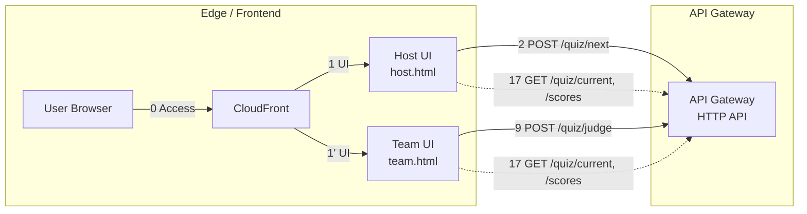
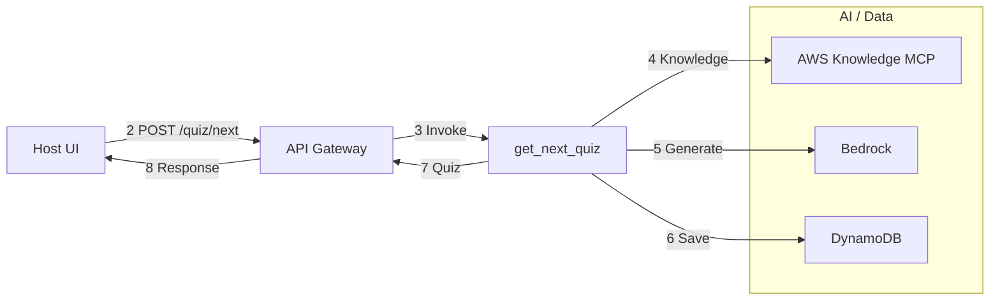
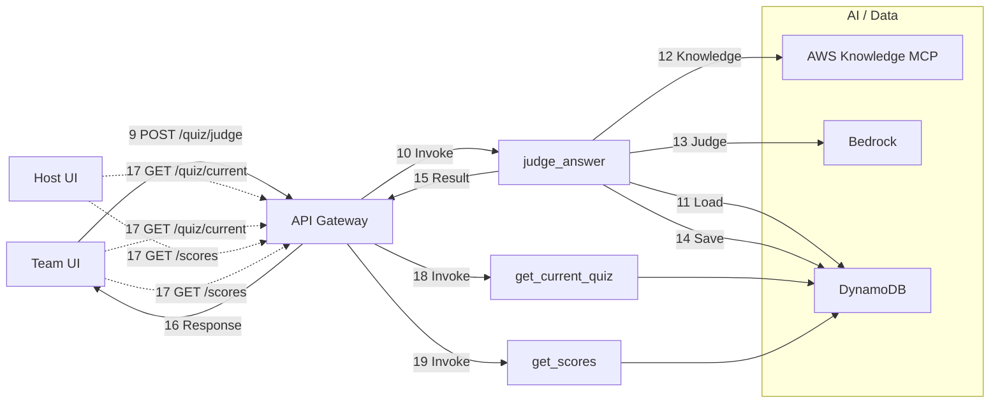
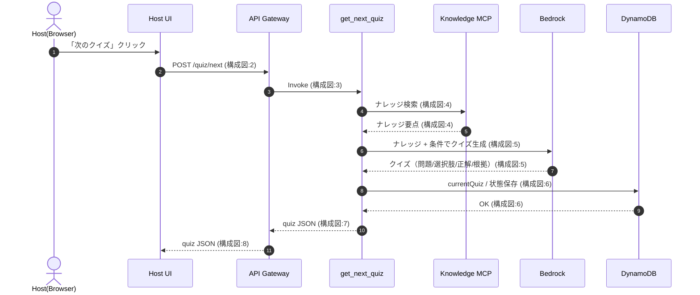
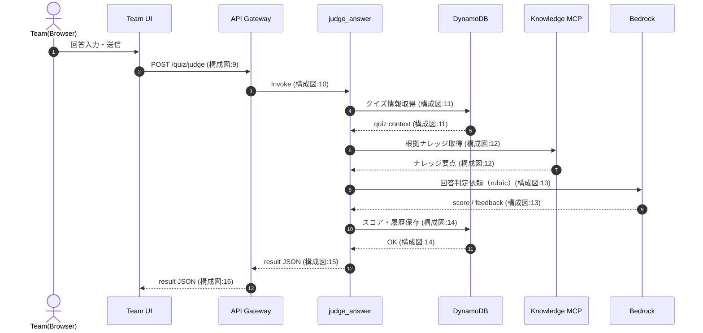
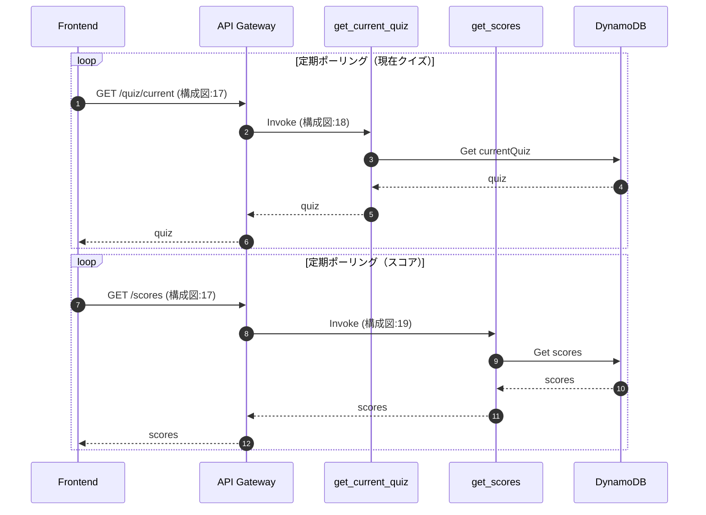

# aws_knowledge_quiz

## 概要

SPAのAWSクイズ出題アプリケーションです。
クイズ出題と回答と採点を行います。
回答に対して、フィードバックを行います。

出題はAWS Knowledge MCP Serverを情報源とし、Amazon Bedrockでクイズを生成します。
回答に対する採点も同MCP Serverを情報源とし、Amazon Bedrockで判定、フィードバックを行います。

## Lambda関数の処理概要

### GetNextQuizFunction
- **役割**: 新しいクイズを生成して出題
- **処理フロー**:
  1. カテゴリとレベルに基づいてMCP検索クエリを決定的に生成
  2. AWS Knowledge MCP Serverから関連ドキュメントを検索
  3. Bedrock Prompt Managementを使用してクイズを生成（MaxTokens: 2400, Temperature: 0.15）
  4. 生成されたクイズの重複チェック（ハッシュ値で判定）
  5. DynamoDBに保存（重複時は503エラー）
- **タイムアウト対策**: 60秒タイムアウト、2048MBメモリ、Bedrock接続タイムアウト5秒/読み取り25秒
- **重複回避**: 最近15問のヒントを参照、カーソルベースのクエリローテーション

### JudgeAnswerFunction
- **役割**: ユーザーの回答を採点してフィードバックを提供
- **処理フロー**:
  1. questionIdで問題情報をDynamoDBから取得
  2. rubric（採点基準）とユーザー回答をBedrockに送信
  3. 必須要点（mustHavePoints）の充足率を判定
  4. correct/close/incorrectの判定とスコア計算
  5. 最大400字のフィードバックを生成
- **採点ポリシー**: correct=100%充足、close=80%充足（scoringPolicyに従う）

### GetCurrentQuizFunction
- **役割**: 現在出題中のクイズを取得
- **処理フロー**:
  1. DynamoDB GSI_Recentから最新1件を取得
  2. 問題情報（タイトル、本文、カテゴリ、レベル）を返却
- **用途**: Host/Team両UIから15秒ごとにポーリング

### GetScoresFunction
- **役割**: 全チームのスコアボードを取得
- **処理フロー**:
  1. ScoresTableをScanして全チームのスコアを取得
  2. スコア降順、更新日時降順でソート
  3. チーム名、スコア、更新日時を返却

### SubmitScoreFunction
- **役割**: 採点結果をスコアボードに反映
- **処理フロー**:
  1. AnswerHistoryTableで回答履歴を確認（初回か再評価か判定）
  2. 初回回答の場合のみScoresTableにスコアを加算
  3. 再評価の場合は履歴のみ更新（スコアは変更しない）
  4. 回答履歴に詳細情報（result、score、feedback、試行回数）を記録

### GetQuizByIdFunction
- **役割**: questionIdを指定して過去のクイズを取得
- **処理フロー**:
  1. questionIdをキーにDynamoDBから問題を取得
  2. 問題情報を返却
- **用途**: 復習機能や過去問参照

## デプロイ方法

### 前準備

- リポジトリのクローン

```bash
git clone https://github.com/hatanoyoshihiko/aws_knowledge_quiz.git
```

- 変数定義

```bash
export AWS_REGION=ap-northeast-1
export FRONTEND_STACK_NAME=aws-knowledge-quiz-frontend
export BACKEND_STACK_NAME=aws-knowledge-quiz-backend
export AWS_PROFILE=YOUR_PROFILE
export API_HEADER_VALUE=YOUR_SECRET_HEADER_VALUE
```

### バックエンドのデプロイ

- CloudFrontのURLを変数として格納する

```bash
CLOUDFRONT_URL="$(aws cloudformation describe-stacks \
  --region "$AWS_REGION" \
  --stack-name "$FRONTEND_STACK_NAME" \
  --query "Stacks[0].Outputs[?OutputKey=='CloudFrontUrl'].OutputValue" \
  --output text)"

echo "CloudFrontUrl=$CLOUDFRONT_URL"
```

- デプロイ
  - StageName: API Gatewayのステージ名（例: dev, prod）
  - FrontendOrigin: CloudFrontのURL（CORS設定用）
  - CloudFrontToApiHeaderValue: CloudFrontからAPI Gatewayへの認証用ヘッダー値（任意の秘密文字列）
  - HostKey: 出題者側UIで入力するキー（任意の値、例: 123456789）
  - CloudFrontDNSName: CloudFrontのドメイン名
  - GeoRestrictionLocations: 地理的制限（例: JP、複数の場合はカンマ区切り）
  - BedrockGuardrailIdentifier: Bedrock Guardrail ID（オプション）
  - BedrockGuardrailVersion: Bedrock Guardrail Version（オプション、デフォルト: DRAFT）

```bash
cd backend
sam build
sam deploy \
  --stack-name "$BACKEND_STACK_NAME" \
  --region "$AWS_REGION" \
  --resolve-s3 \
  --capabilities CAPABILITY_IAM \
  --parameter-overrides \
    StageName=dev \
    FrontendOrigin="https://d1234567890abc.cloudfront.net" \
    CloudFrontToApiHeaderValue="$API_HEADER_VALUE" \
    HostKey=YOUR_HOST_KEY \
    CloudFrontDNSName="d1234567890abc.cloudfront.net" \
    GeoRestrictionLocations=JP \
    BedrockGuardrailIdentifier=YOUR_GUARDRAIL_ID \
    BedrockGuardrailVersion=1
```

- API EndpointのURLを変数として格納する

```bash
API_ENDPOINT="$(aws cloudformation describe-stacks \
  --region "$AWS_REGION" \
  --stack-name "$BACKEND_STACK_NAME" \
  --query "Stacks[0].Outputs[?OutputKey=='ApiGatewayDomainName'].OutputValue" \
  --output text)"

API_ORIGIN_PATH="$(aws cloudformation describe-stacks \
  --region "$AWS_REGION" \
  --stack-name "$BACKEND_STACK_NAME" \
  --query "Stacks[0].Outputs[?OutputKey=='ApiGatewayOriginPath'].OutputValue" \
  --output text)"

echo "ApiGatewayDomainName=$API_ENDPOINT"
echo "ApiGatewayOriginPath=$API_ORIGIN_PATH"
```

### フロントエンドのデプロイ

- この時点ではまだコンテンツファイルはアップロードしません。
  - CloudFrontToApiHeaderValue: バックエンドと同じ値を設定
  - ApiGatewayDomainName: API Gatewayのドメイン名（例: abc123.execute-api.ap-northeast-1.amazonaws.com）
  - ApiGatewayOriginPath: API Gatewayのステージパス（例: /dev）

```bash
cd frontend
sam build
sam deploy \
  --stack-name "$FRONTEND_STACK_NAME" \
  --region "$AWS_REGION" \
  --resolve-s3 \
  --capabilities CAPABILITY_IAM \
  --parameter-overrides \
    CloudFrontToApiHeaderValue="$API_HEADER_VALUE" \
    ApiGatewayDomainName="abc123.execute-api.ap-northeast-1.amazonaws.com" \
    ApiGatewayOriginPath=/dev
```

- フロントエンド用S3バケット名を変数として格納する

```bash
BUCKET_NAME="$(aws cloudformation describe-stacks \
  --region "$AWS_REGION" \
  --stack-name "$FRONTEND_STACK_NAME" \
  --query "Stacks[0].Outputs[?OutputKey=='FrontendBucketName'].OutputValue" \
  --output text)"

echo "BucketName=$BUCKET_NAME"
```

- index.htmlとconfig.jsonのアップロード

```bash
cd ../frontend
aws s3 sync public "s3://$BUCKET_NAME/" --delete
```

### 動作確認

`echo "https://$CLOUDFRONT_URL"`

## UI

### 出題側

- `Host Key` にバックエンドのデプロイ時に指定したHostKeyを入力します
- カテゴリとレベルを選択します
- `次のクイズ` ボタンを押下すると、30秒程度でクイズが生成されます
- Scoreboardは10位までが表示され、11位以降は折りたたまれます

### 回答側

- 出題側と同じクイズが表示されます。15秒に1度画面が更新されますが、 `更新` ボタンを押下すると即時反映されます
- チーム名を入力し、 `回答` 欄を入力後、 `採点する` ボタンを押下すると採点結果が表示されます
- `結果`にスコアやコメントが出力されます。さらに ``表示 ボタンを押下すると、どの要点に過不足があるかを確認出来ます

## 仕様

### システム構成図

> ※ 本図は処理全体の俯瞰を目的としており、
> クイズ状態・スコアの同期（GET /quiz/current, /scores）は
> ポーリングとして簡略表現しています。
> 詳細な処理順は以下のシーケンス図を参照してください。

### 1) エッジ＋API入口



### 2) 出題フロー（NextQuiz）



### 3) 採点＋同期（Judge / Sync）



### シーケンス図

- 「次のクイズ」ボタンを押したとき



- 「採点する」ボタンを押したとき



- クイズの表示同期（全クライアント）



## 主なロジック

クイズや採点アルゴリズムは [logic.md](./docs/logic.md) を参照下さい。

## クイズの出題内容を調整する場合

[ファイル名：app.py](./backend/src/get_next_quiz/app.py)

Bedrockに渡すプロンプトを調整します。
下記がソースコード内で指定しています。

- QUERY_COMPONENTS
  - カテゴリごとのMCP検索クエリ生成用の部品（services、topics、angles）
  - 決定的な組み合わせでクエリを生成し、重複を回避
- QUESTION_STYLES
  - クイズの出題スタイル（使い分け、トレードオフ、誤り探し、運用・障害対応、監査・コンプラ観点、コスト最適化）
  - Bedrockへの出題方針として渡される

## Bedrockのコンフィグ

### クイズ生成（GetNextQuizFunction）
- **モデル**: jp.anthropic.claude-sonnet-4-5-20250929-v1:0
- **MaxTokens**: 2400（JSON完全出力を保証）
- **Temperature**: 0.15（多様性と品質のバランス）
- **タイムアウト**: 接続5秒、読み取り25秒、リトライ1回
- **プロンプト管理**: Bedrock Prompt Managementを使用

### 回答採点（JudgeAnswerFunction）
- **モデル**: jp.anthropic.claude-sonnet-4-5-20250929-v1:0
- **フィードバック最大長**: 400字
- **採点基準**: rubric（mustHavePoints、niceToHavePoints、commonWrongClaims、scoringPolicy）

### Guardrail設定（オプション）
- BedrockGuardrailIdentifierとBedrockGuardrailVersionを設定することで、不適切なコンテンツをブロック可能
- Guardrailがブロックした場合は適切なエラーメッセージを返却

## パフォーマンス最適化の履歴

### タイムアウト対策
- Lambda実行時間: 60秒
- Lambdaメモリ: 2048MB（GetNextQuizFunction）
- Bedrock接続タイムアウト: 5秒
- Bedrock読み取りタイムアウト: 25秒
- 残り時間チェック: 35秒未満で生成ループを停止

### クイズ生成の多様性向上
- MAX_MCP_REFRESH: 0→2（異なるMCPクエリで再試行）
- Temperature: 0.05→0.15（出力の多様性向上）
- カーソルベースのクエリローテーション（決定的な組み合わせ生成）
- 重複回避ヒント: 最近15問のタイトル、タグ、論点を参照

### JSON出力の安定化
- MaxTokens: 1200→2400（段階的に増加）
- 文字数制約の緩和: body≤240字、expectedAnswer≤240字、sourceSummary≤160字
- JSON救済処理: コードフェンス除去、外側オブジェクト抽出
- プロンプト改善: 「必ず完全なJSONを出力」を強調

### フィードバック長の調整
- feedback最大長: 280字→400字（より詳細なフィードバックを提供）
