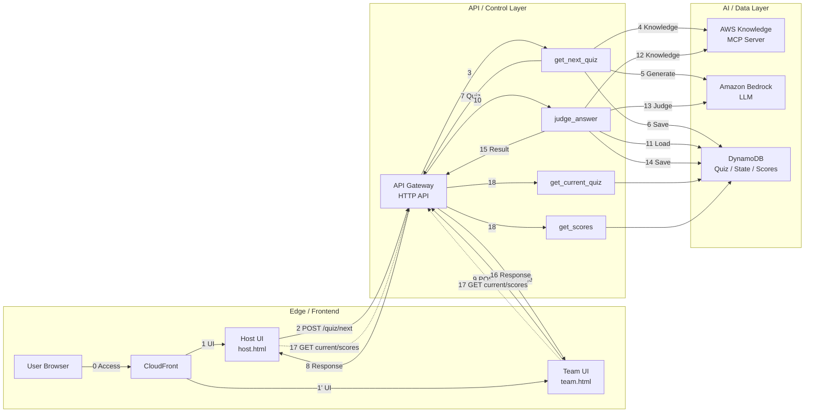
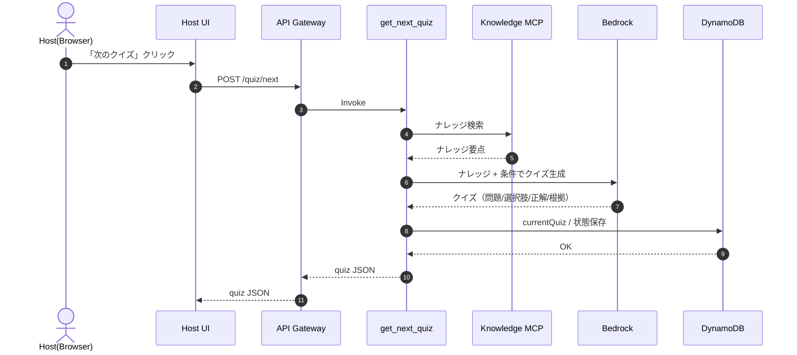
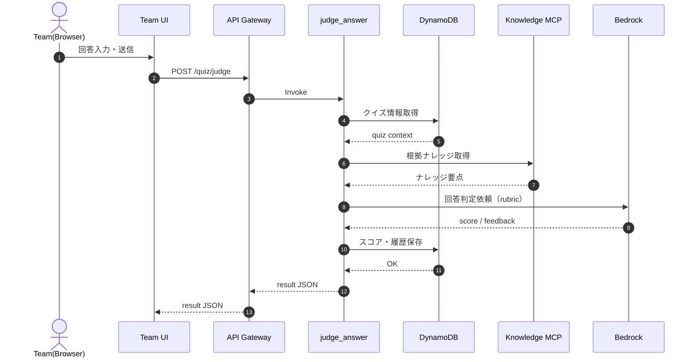
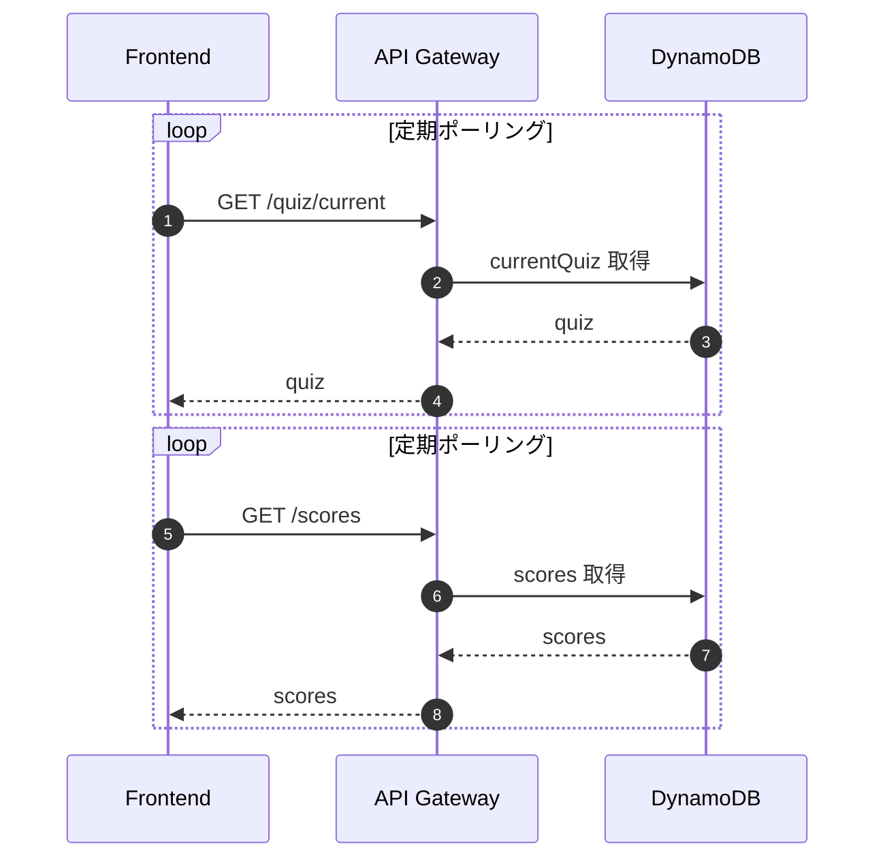

# aws_knowledge_quiz

## 概要

SPAのAWSクイズ出題アプリケーションです。
クイズ出題と回答と採点を行います。
回答に対して、フィードバックを行います。

出題はAWS Knowledge MCP Serverを情報源とし、Amazon Bedrockでクイズを生成します。
回答に対する採点も同MCP Serverを情報源とし、Amazon Bedrockで判定、フードバックを行います。

## デプロイ方法

### 前準備

- リポジトリのクローン

```bash
git clone https://github.com/hatanoyoshihiko/aws_knowledge_quiz.git
```

- 変数定義

```bash
export AWS_REGION=ap-northeast-1
export FRONTEND_STACK_NAME=aws-knowledge-quiz-frontend
export BACKEND_STACK_NAME=aws-knowledge-quiz-backend
export AWS_PROFILE=YOUR_PROFILE
export API_HEADER_VALUE=1234567890qwertyuiop@
```

### バックエンドのデプロイ

- CloudFrontのURLを変数として格納する

```bash
CLOUDFRONT_URL="$(aws cloudformation describe-stacks \
  --region "$AWS_REGION" \
  --stack-name "$FRONTEND_STACK_NAME" \
  --query "Stacks[0].Outputs[?OutputKey=='CloudFrontUrl'].OutputValue" \
  --output text)"

echo "CloudFrontUrl=$CLOUDFRONT_URL"
```

- デプロイ
  - CloudFrontToApiHeaderValueは任意の値を設定して下さい
  - HostKeyも任意の値を設定して下さい

```bash
cd backend
sam build
sam deploy \
  --stack-name "$BACKEND_STACK_NAME" \
  --region "$AWS_REGION" \
  --s3-bucket aws-sam-cli-managed-default-xxx \
  --capabilities CAPABILITY_IAM \
  --parameter-overrides \
    StageName=dev  \
    FrontendOrigin="$CLOUDFRONT_URL" \
    CloudFrontToApiHeaderValue="$API_HEADER_VALUE" \
    HostKey=123456789 \
    CloudFrontDNSName="$CLOUDFRONT_URL" \
    GeoRestrictionLocations=JP
```

- API EndpointのURLを変数として格納する

```bash
API_ENDPOINT="$(aws cloudformation describe-stacks \
  --region "$AWS_REGION" \
  --stack-name "$BACKEND_STACK_NAME" \
  --query "Stacks[0].Outputs[?OutputKey=='ApiEndpoint'].OutputValue" \
  --output text)"

echo "ApiEndpoint=$API_ENDPOINT"
```

### フロントエンドのデプロイ

- この時点ではまだコンテンツファイルはアップロードしません。

```bash
cd frontend
sam build
sam deploy \
  --stack-name "$FRONTEND_STACK_NAME" \
  --region "$AWS_REGION" \
  --s3-bucket aws-sam-cli-managed-default-xxx \
  --capabilities CAPABILITY_IAM \
  --parameter-overrides \
    CloudFrontToApiHeaderValue="$API_HEADER_VALUE" \
    ApiGatewayDomainName=$API_ENDPOINT \
    ApiGatewayOriginPath=/dev
```

- フロントエンド用S3バケット名を変数として格納する

```bash
BUCKET_NAME="$(aws cloudformation describe-stacks \
  --region "$AWS_REGION" \
  --stack-name "$FRONTEND_STACK_NAME" \
  --query "Stacks[0].Outputs[?OutputKey=='FrontendBucketName'].OutputValue" \
  --output text)"

echo "BucketName=$BUCKET_NAME"
```

- index.htmlとconfig.jsonのアップロード

```bash
cd ../frontend
aws s3 sync public "s3://$BUCKET_NAME/" --delete
```

### 動作確認

`echo "https://$CLOUDFRONT_URL"`

## 仕様

### システム全体構成図

> ※ 本図は処理全体の俯瞰を目的としており、
> クイズ状態・スコアの同期（GET /quiz/current, /scores）は
> ポーリングとして簡略表現しています。
> 詳細な処理順は以下のシーケンス図を参照してください。



### シーケンス図

- 「次のクイズ」ボタンを押したとき



- 「採点する」ボタンを押したとき



- クイズの表示同期（全クライアント）



## 主なロジック

[logic.md](./docs/logic.md) を

## クイズの出題内容を調整する場合

[ファイル名：app.py](./backend/src/get_next_quiz/app.py)

Bedrockに渡すプロンプトを調整します。
下記がソースコード内で指定しています。

- SYSTEM_PROMPT
  - クイズのルールを定義しています
- USER_PROMPT_TEMPLATE
  - クイズの生成アルゴリズムを定義しています
- QUERYSETS
  - AWS Knowledge MCP Serverで検索するためのクイズカテゴリごとのキーワードを定義しています

## Bedrockのコンフィグ

[ファイル名：bedrock.py](./backend/layers/common/python/common/bedrock.py)

`inferenceConfig={"temperature": 0.2, "maxTokens": 2200}` を定義しています。
temperatureを **0.4** など大きくするとクイズや採点文言の表現が揺らぎます。
