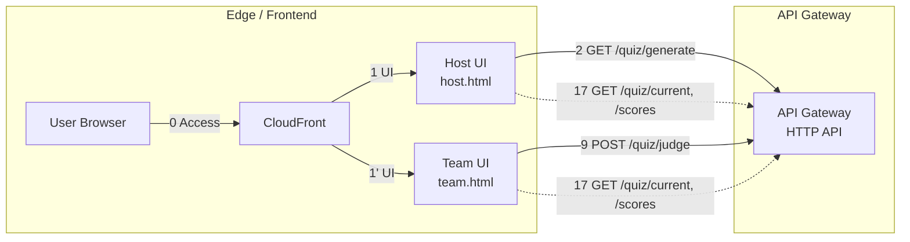
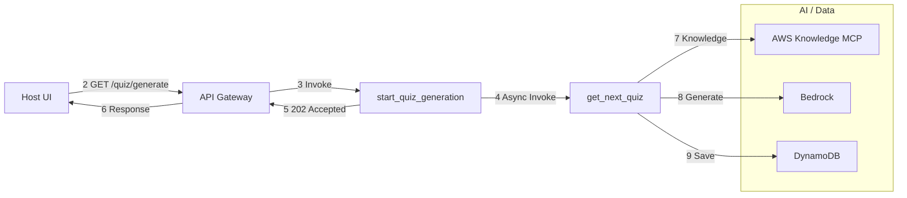
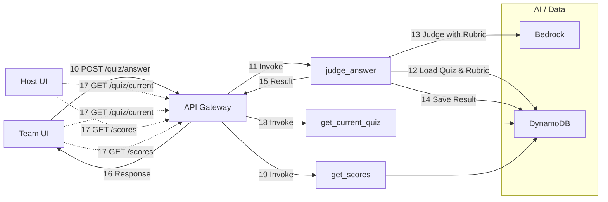
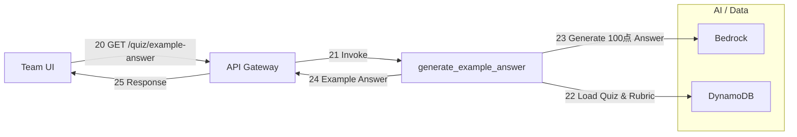
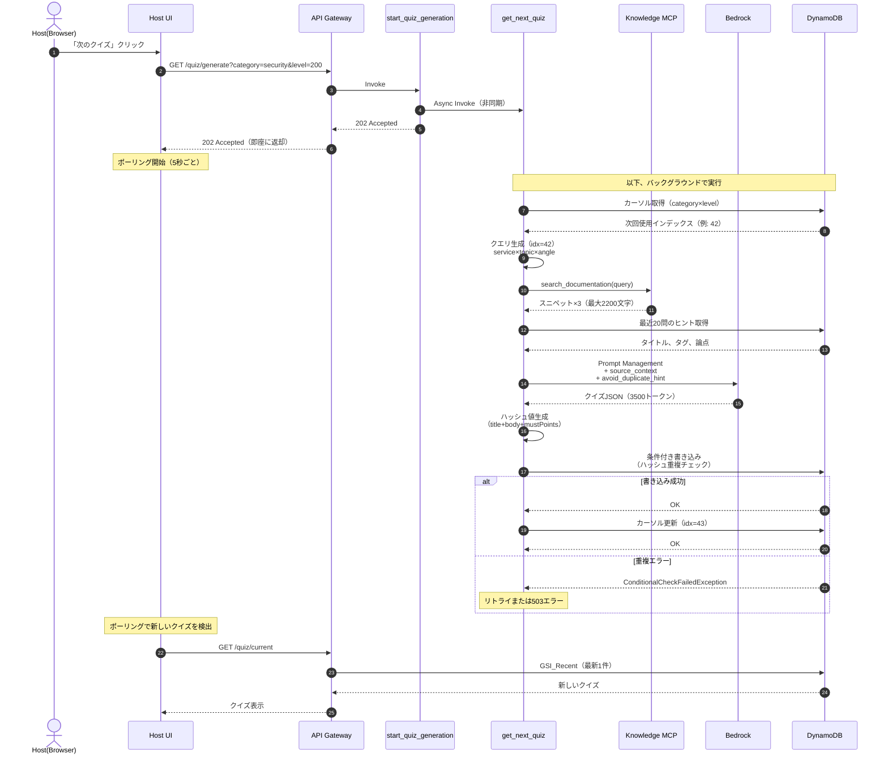
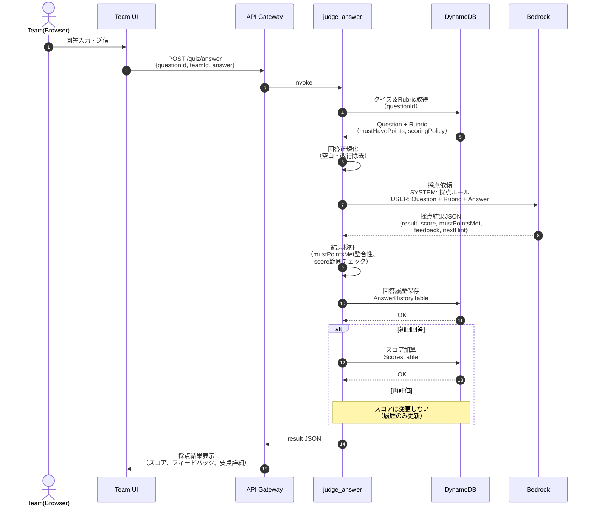
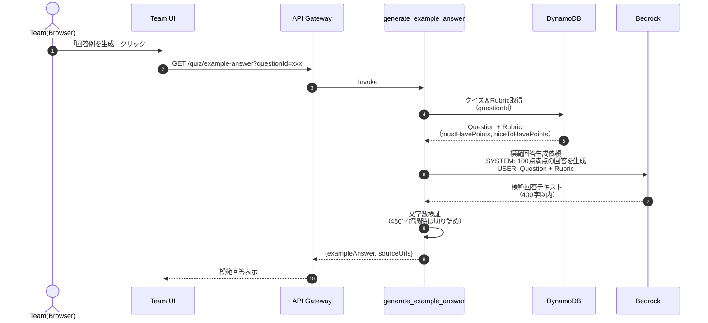
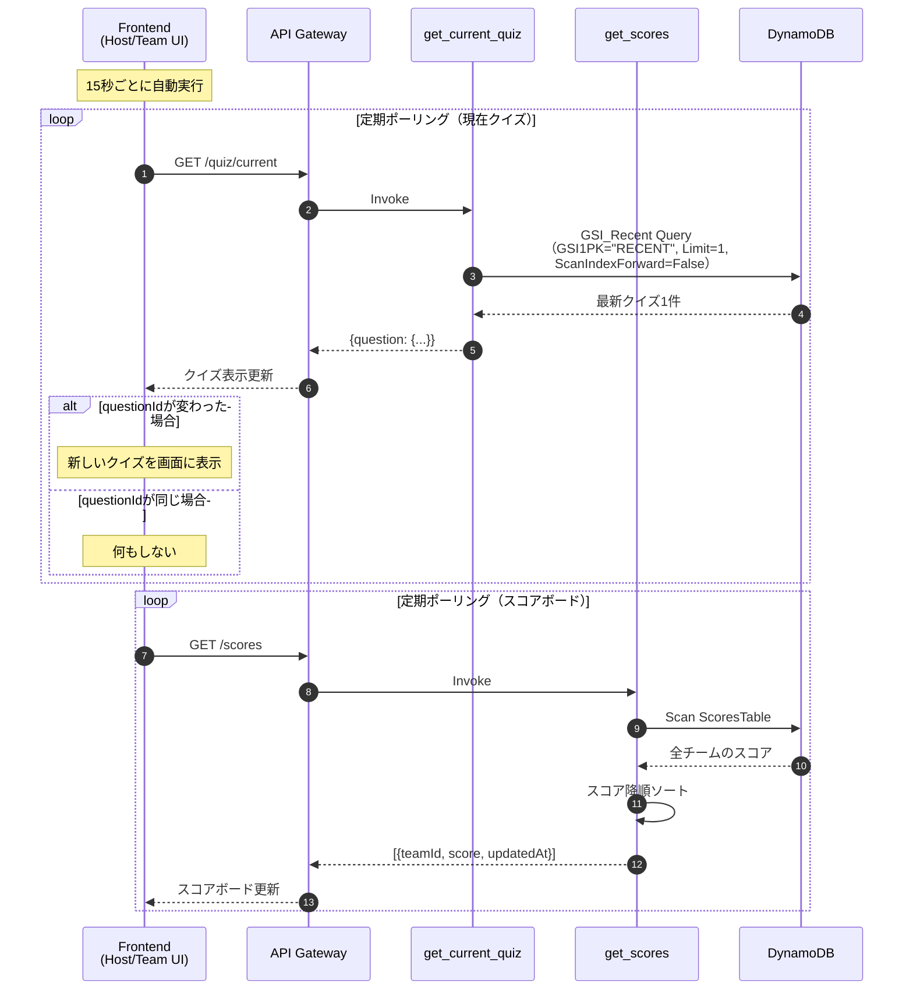

# システムアーキテクチャ

AWSクイズアプリケーションのシステムアーキテクチャを図で説明。

> **注意**: 本図は処理全体の俯瞰を目的とし、クイズ状態・スコアの同期（GET /quiz/current, /scores）はポーリングとして簡略表現。詳細な処理順は各シーケンス図を参照。

## 1) エッジ＋API入口

## 2) 出題フロー（NextQuiz）

## 3) 採点＋同期（Judge / Sync）

## 4) 回答例生成（Example Answer）

## シーケンス図

### 1. クイズ生成フロー（非同期）

「次のクイズ」ボタンを押したときの処理フロー

### 2. 採点フロー

「採点する」ボタンを押したときの処理フロー

### 3. 回答例生成フロー

「回答例を生成」ボタンを押したときの処理フロー

### 4. クイズ同期フロー（ポーリング）

Host UIとTeam UIが最新クイズとスコアを取得する処理フロー

## 重複回避の仕組み

クイズ生成時の重複回避は3段階で実施：

1. **カーソルベースのクエリローテーション**: 決定的な順序で全クエリを使用
2. **ハッシュ値による重複チェック**: DynamoDB条件付き書き込みで完全一致を排除
3. **最近20問のヒント**: Bedrockに渡して類似問題を回避

詳細は [クイズ生成の仕組み](./quiz.md#重複回避の仕組み) を参照。
