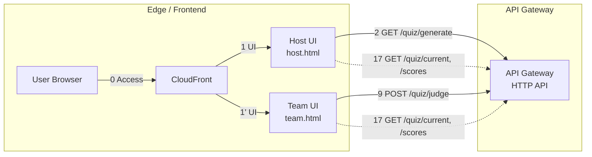
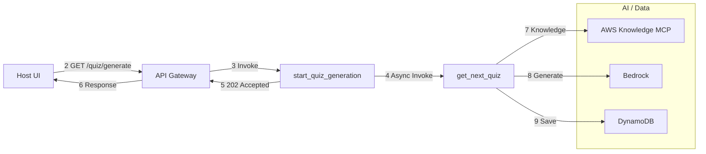
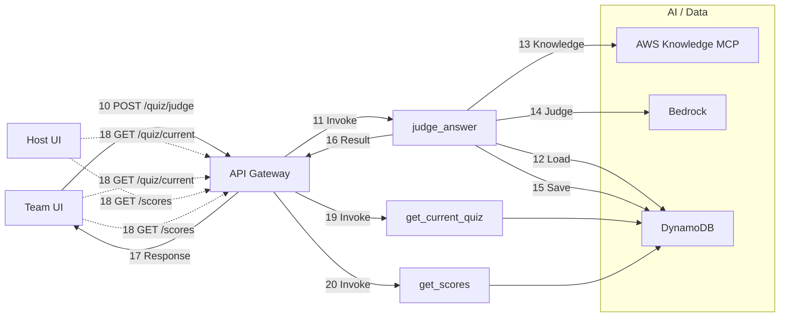
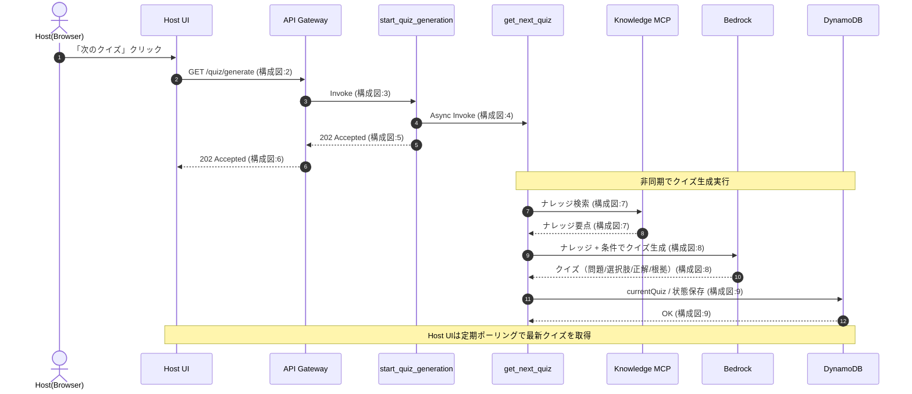
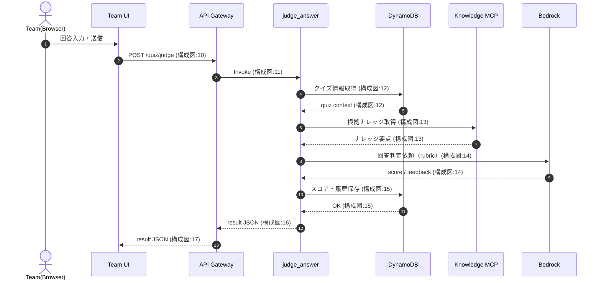
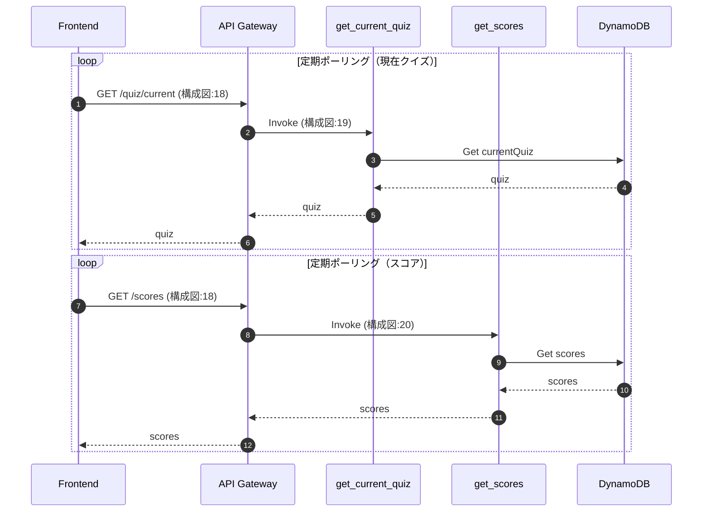

### システム構成図

> ※ 本図は処理全体の俯瞰を目的としており、

> クイズ状態・スコアの同期（GET /quiz/current, /scores）は

> ポーリングとして簡略表現しています。

> 詳細な処理順は以下のシーケンス図を参照してください。

### 1) エッジ＋API入口

### 2) 出題フロー（NextQuiz）

### 3) 採点＋同期（Judge / Sync）

### シーケンス図

- 「次のクイズ」ボタンを押したとき

- 「採点する」ボタンを押したとき

- クイズの表示同期（全クライアント）

